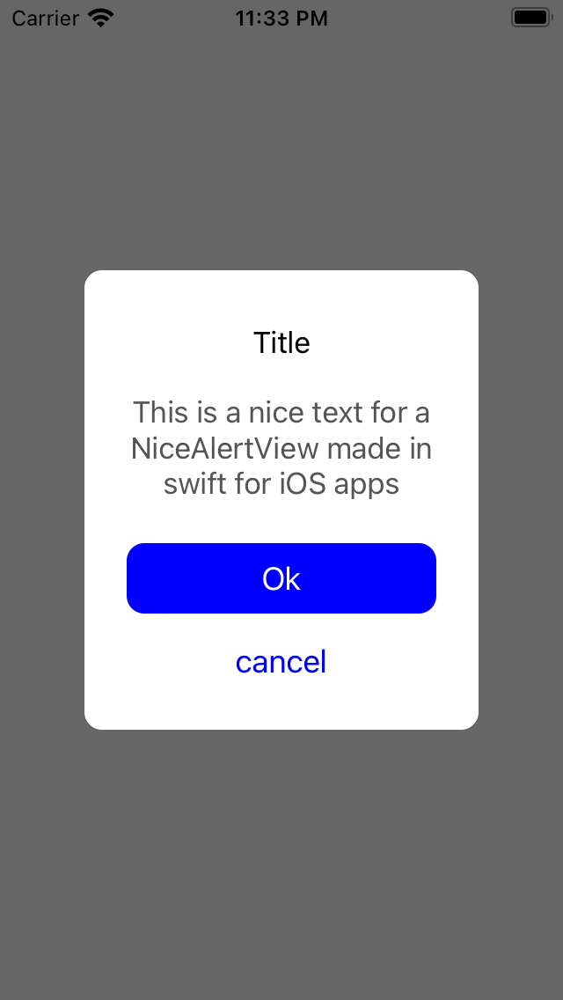

# NiceAlertView
### _Nice and beautiful AlertView for your iOS project_

Screenshots
---------


NiceAlertView is a Swift framework that can increase time of development and show nice custom AlertsViews

```swift
let popUp = PopUpView()
popUp.setup(title: "Title",
            subtitle: "This is a nice text for a NiceAlertView made in swift for iOS apps",
            btnConfirm: "Ok",
            btnCancel: "cancel",
            { _ in })
self.view.addSubview(popUp)
```

## License

MIT
